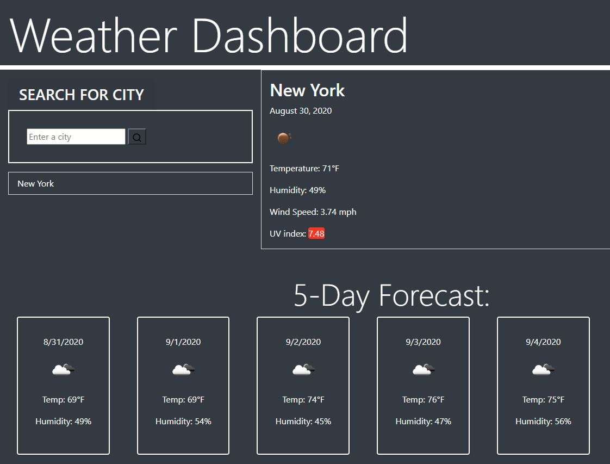

## Weather Dashboard App

## Description
A simple weather app that provides a current and five day weather forecast for your convenience.
Weather forecasts consist of date, icon representation of weather condition, temperature, wind speed, humidity and UV index.
Your searches are also saved within your local storage and will also be presented as a button below the search bar.
Enjoy!

## Created using
- HTML
- CSS
- JS

## Weather API
https://openweathermap.org/

## Link to Website
https://itsrheine.github.io/weather-app/

## Link to Github
https://github.com/itsrheine/weather-app/

## Screenshot

